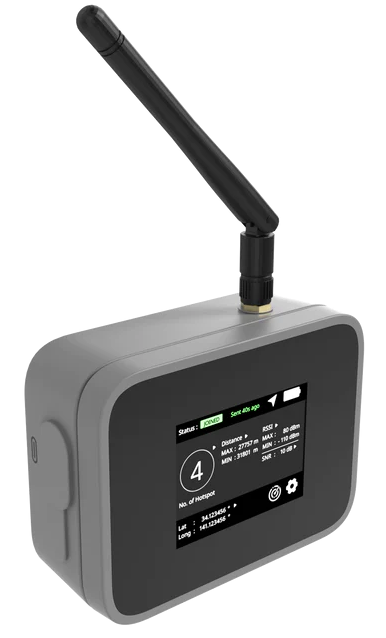

# RAK10701 Field Tester

| 

  | 

 | 

 | 

 | 

  |
| -- | -- | -- | -- | -- |

----

The RAK10701-P Field Tester for LoRaWAN is a ready-to-use WisNode for evaluating deployed LoRaWAN network, which comes in a hard case and two different antenna types. It has a GNSS and a touchscreen LCD for the user interface, which displays the number of gateways the device can reach and other parameters like approximate distance, RSSI, and SNR. It is powered by a rechargeable battery and can be charged via USB Type-C interface.

----

When deploying LoRaWAN Gateways, it is crucial to know whether they are far enough away from each other and if the area that should be covered by the gateways is in range at any location. It is important to locate the dead spots in your LoRaWAN network coverage.

When deploying LoRaWAN sensor nodes, it is crucial to know whether all sensor nodes are in the range of a gateway or hotspot.

With a LoRaWAN Field Tester , it is now easy to investigate whether the required area of sensor nodes is covered by gateways or if there are blind spots in which the sensor data cannot reach any gateway.

----

## _Important_

:exclamation: _**This source code is based on RAKwireless RUI3. Please check the RUI3 documentation how to install the RUI3 BSP's**_ :exclamation:

:collision: _**Some libraries used in this application are changed to work with RUI3. You need to install the libraries from the `Lib_used` folder in your Arduino library folder.**_ :collision:

----

## Content of the repository

### RAK10701-P-L.v1.0.6

This folder has the source files

----

### Lib_Used

This folder contains the libraries required to build the application. :collision: _**Some libraries used in this application are changed to work with RUI3. You need to install the libraries from the `Lib_used` folder in your Arduino library folder.**_ :collision:

----

# Documentation

You can find more information in the [README file for the sources](./RAK10701-P-L.v1.0.6/README.md) 

Documentation for the usage and replacing the end-point required can be found in the [RAKwireless Documentation Center](https://docs.rakwireless.com/Product-Categories/WisNode/RAK10701-P/Overview)

